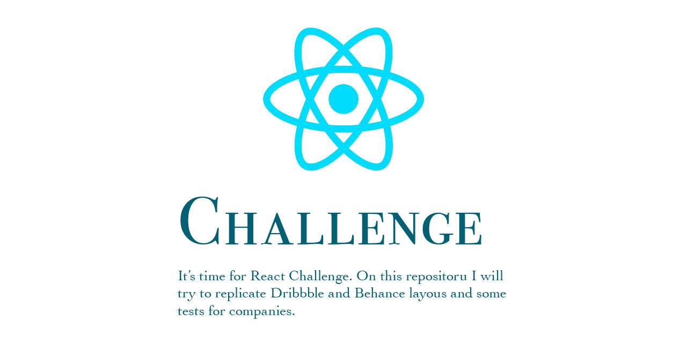

# Frontend Challenges

This repository was created as an online guide to help other people with some implementations in React. I will try to cover here different kind of layouts. Feel free to use and share!

| Source                                                                                               | Author                                              | Description                                                                                                                          | Stack              | Git |
| ---------------------------------------------------------------------------------------------------- | --------------------------------------------------- | ------------------------------------------------------------------------------------------------------------------------------------ | ------------------ | --- |
| [Dribbble](https://dribbble.com/shots/11036108-Luxury-places-booking/attachments/2631175?mode=media) | [Maxim Synyava](https://dribbble.com/maxim_synyava) | Conceptual design for R•lax web app. With R•lax you can find, inspire and book luxury apartments in beautiful places over the world. | React + TypeScript | -   |

## License

[MIT](/license) &copy; Marcio Montenegro